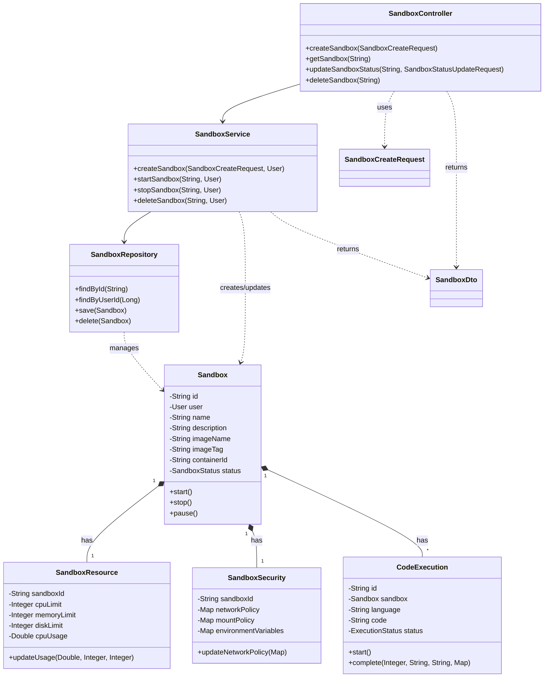

# 통합 AGI 시스템 객체 모델 설계

## 1. 개요

이 문서는 Spring Boot 3.4.5, Java 17 기반의 통합 AGI 시스템을 위한 객체 모델 설계를 설명합니다. 객체 모델은 도메인 주도 설계(Domain-Driven Design) 원칙을 일부 적용하여 시스템의 핵심 개념과 관계를 클래스 및 인터페이스로 표현합니다. 이 설계는 시스템 아키텍처, 데이터베이스 스키마, API 설계와 일관성을 유지합니다.

## 2. 설계 원칙

1.  **응집도 높고 결합도 낮은 설계**: 각 클래스와 모듈은 특정 책임에 집중하고 다른 컴포넌트와의 의존성을 최소화합니다.
2.  **명확한 책임 분리**: Controller, Service, Repository, Domain Entity, DTO 등의 계층별 책임을 명확히 구분합니다.
3.  **인터페이스 기반 설계**: 주요 컴포넌트 간의 상호작용은 인터페이스를 통해 정의하여 유연성과 테스트 용이성을 높입니다.
4.  **불변성 활용**: 가능한 경우 불변 객체(Immutable Objects)를 사용하여 상태 관리의 복잡성을 줄이고 스레드 안전성을 높입니다.
5.  **DTO 사용**: API 계층과 서비스 계층 간 데이터 전달 시 DTO(Data Transfer Object)를 사용하여 도메인 모델 노출을 최소화하고 API 계약을 명확히 합니다.
6.  **JPA 엔티티 설계 가이드라인 준수**: 이전에 정의된 JPA 엔티티 설계 가이드라인(생성자 빌더, 보호된 기본 생성자 등)을 따릅니다.
7.  **샌드박스 격리**: 샌드박스 환경에서 실행되는 코드와 작업은 명확히 격리되고 제한된 자원 내에서 안전하게 실행되도록 설계합니다.

## 3. 주요 패키지 구조

```
com.agi
├── AgiApplication.java
├── config          // 설정 클래스 (QuerydslConfig, SecurityConfig 등)
├── controller      // API 요청 처리 (RestController)
│   ├── dto         // Controller 계층 DTO (Request/Response)
│   └── impl        // Controller 구현체
├── domain          // 핵심 도메인 모델
│   ├── entity      // JPA 엔티티
│   ├── repository  // 데이터 접근 인터페이스 (Spring Data JPA)
│   └── vo          // 값 객체 (Value Objects)
├── service         // 비즈니스 로직 처리
│   ├── dto         // Service 계층 DTO
│   ├── impl        // Service 구현체
│   └── module      // AGI 핵심 모듈 인터페이스 및 구현
├── sandbox         // 샌드박스 관련 클래스
│   ├── entity      // 샌드박스 엔티티
│   ├── repository  // 샌드박스 저장소
│   ├── service     // 샌드박스 서비스
│   ├── dto         // 샌드박스 DTO
│   ├── executor    // 코드 실행 엔진
│   └── security    // 샌드박스 보안 정책
├── exception       // 사용자 정의 예외 클래스
├── util            // 유틸리티 클래스
└── common          // 공통 코드 (상수, 기본 클래스 등)
```

## 4. 핵심 도메인 객체 모델

### 4.1 사용자 도메인 (User Domain)

-   **Entity**: `User`, `Role`, `Permission`, `Session`
-   **Repository**: `UserRepository`, `RoleRepository`, `PermissionRepository`, `SessionRepository`
-   **Service**: `UserService`, `AuthService`
-   **Controller**: `UserController`, `AuthController`
-   **DTO**: `UserDto`, `RoleDto`, `PermissionDto`, `LoginRequest`, `RegisterRequest`, `JwtTokenResponse`

```java
// Entity 예시: User.java
@Entity
@Table(name = "user")
@Getter
@NoArgsConstructor(access = AccessLevel.PROTECTED)
public class User extends BaseTimeEntity {
    @Id @GeneratedValue(strategy = GenerationType.IDENTITY)
    private Long id;

    @Column(nullable = false, unique = true, length = 50)
    private String username;

    @Column(nullable = false, unique = true, length = 100)
    private String email;

    @Column(nullable = false)
    private String passwordHash;

    // ... 기타 필드

    @ManyToMany(fetch = FetchType.EAGER)
    @JoinTable(
        name = "user_role",
        joinColumns = @JoinColumn(name = "user_id"),
        inverseJoinColumns = @JoinColumn(name = "role_id")
    )
    private Set<Role> roles = new HashSet<>();

    @Builder
    public User(String username, String email, String passwordHash, String firstName, String lastName) {
        this.username = username;
        this.email = email;
        this.passwordHash = passwordHash;
        // ... 필드 초기화
    }
}

// DTO 예시: UserDto.java
@Getter
@Builder
public class UserDto {
    private Long id;
    private String username;
    private String email;
    private String firstName;
    private String lastName;
    private LocalDateTime createdAt;
    private Set<String> roles;

    public static UserDto fromEntity(User user) {
        return UserDto.builder()
            .id(user.getId())
            .username(user.getUsername())
            .email(user.getEmail())
            // ... 매핑
            .roles(user.getRoles().stream().map(Role::getName).collect(Collectors.toSet()))
            .build();
    }
}

// Service 예시: UserService.java
@Service
@RequiredArgsConstructor
@Transactional(readOnly = true)
public class UserService {
    private final UserRepository userRepository;
    private final RoleRepository roleRepository;
    private final PasswordEncoder passwordEncoder;

    @Transactional
    public UserDto registerUser(RegisterRequest request) {
        // 중복 검사
        if (userRepository.existsByUsername(request.getUsername())) {
            throw new UserAlreadyExistsException("Username already exists: " + request.getUsername());
        }
        // 비밀번호 암호화
        String encodedPassword = passwordEncoder.encode(request.getPassword());
        // 기본 역할 할당
        Role userRole = roleRepository.findByName("ROLE_USER")
            .orElseThrow(() -> new RoleNotFoundException("Default role ROLE_USER not found"));

        User newUser = User.builder()
            .username(request.getUsername())
            .email(request.getEmail())
            .passwordHash(encodedPassword)
            .build();
        newUser.getRoles().add(userRole);

        User savedUser = userRepository.save(newUser);
        return UserDto.fromEntity(savedUser);
    }
    // ... 기타 메서드
}
```

### 4.2 대화 도메인 (Conversation Domain)

-   **Entity**: `Conversation`, `Message`, `Intent`, `Entity`, `Sentiment`
-   **Repository**: `ConversationRepository`, `MessageRepository`, `IntentRepository`, `EntityRepository`, `SentimentRepository`
-   **Service**: `ConversationService`, `MessageService`
-   **Controller**: `ConversationController` (NLP Controller 내 통합 가능)
-   **DTO**: `ConversationDto`, `MessageDto`, `IntentDto`, `EntityDto`, `SentimentDto`, `ConversationRequest`, `ConversationResponse`

```java
// Entity 예시: Message.java
@Entity
@Table(name = "message")
@Getter
@NoArgsConstructor(access = AccessLevel.PROTECTED)
public class Message {
    @Id
    private String id;

    @ManyToOne(fetch = FetchType.LAZY)
    @JoinColumn(name = "conversation_id", nullable = false)
    private Conversation conversation;

    @Enumerated(EnumType.STRING)
    @Column(nullable = false)
    private MessageRole role;

    @Lob
    @Column(nullable = false)
    private String content;

    @Column(name = "created_at", nullable = false, updatable = false)
    private LocalDateTime createdAt;

    @Lob
    private byte[] embedding;

    @JdbcTypeCode(SqlTypes.JSON)
    private Map<String, Object> metadata;

    @OneToMany(mappedBy = "message", cascade = CascadeType.ALL, orphanRemoval = true)
    private List<Intent> intents = new ArrayList<>();

    @OneToMany(mappedBy = "message", cascade = CascadeType.ALL, orphanRemoval = true)
    private List<EntityExtraction> entities = new ArrayList<>(); // Entity는 예약어일 수 있으므로 이름 변경

    @OneToOne(mappedBy = "message", cascade = CascadeType.ALL, orphanRemoval = true)
    private Sentiment sentiment;

    @Builder
    public Message(Conversation conversation, MessageRole role, String content, Map<String, Object> metadata) {
        this.id = UUID.randomUUID().toString();
        this.conversation = conversation;
        this.role = role;
        this.content = content;
        this.metadata = metadata;
        this.createdAt = LocalDateTime.now();
    }
    // 연관관계 편의 메서드 추가 가능
}

// DTO 예시: MessageDto.java
@Getter
@Builder
public class MessageDto {
    private String id;
    private String conversationId;
    private String role;
    private String content;
    private LocalDateTime createdAt;
    private Map<String, Object> metadata;
    private List<IntentDto> intents;
    private List<EntityDto> entities;
    private SentimentDto sentiment;

    public static MessageDto fromEntity(Message message) {
        return MessageDto.builder()
            .id(message.getId())
            .conversationId(message.getConversation().getId())
            .role(message.getRole().name())
            .content(message.getContent())
            .createdAt(message.getCreatedAt())
            .metadata(message.getMetadata())
            // ... 연관 DTO 매핑
            .build();
    }
}
```

### 4.3 도구 도메인 (Tool Domain)

-   **Entity**: `Tool`, `ToolParameter`, `ToolExecution`
-   **Repository**: `ToolRepository`, `ToolParameterRepository`, `ToolExecutionRepository`
-   **Service**: `ToolService`, `ToolExecutorService`
-   **Controller**: `ToolController`
-   **DTO**: `ToolDto`, `ToolParameterDto`, `ToolExecutionDto`, `ToolExecutionRequest`, `ToolExecutionResponse`
-   **Interface**: `Tool` (실제 도구 구현체 인터페이스)

```java
// Entity 예시: ToolExecution.java
@Entity
@Table(name = "tool_execution")
@Getter
@NoArgsConstructor(access = AccessLevel.PROTECTED)
public class ToolExecution {
    @Id
    private String id;

    @ManyToOne(fetch = FetchType.LAZY)
    @JoinColumn(name = "tool_id", nullable = false)
    private Tool tool;

    @ManyToOne(fetch = FetchType.LAZY)
    @JoinColumn(name = "user_id")
    private User user;

    @ManyToOne(fetch = FetchType.LAZY)
    @JoinColumn(name = "session_id")
    private Session session;

    @ManyToOne(fetch = FetchType.LAZY)
    @JoinColumn(name = "sandbox_id")
    private Sandbox sandbox; // 샌드박스 내에서 실행되는 경우 연결

    @JdbcTypeCode(SqlTypes.JSON)
    private Map<String, Object> parameters;

    @JdbcTypeCode(SqlTypes.JSON)
    private Map<String, Object> result;

    @Enumerated(EnumType.STRING)
    @Column(nullable = false)
    private ExecutionStatus status;

    @Lob
    private String errorMessage;

    @Column(nullable = false, updatable = false)
    private LocalDateTime createdAt;
    private LocalDateTime startedAt;
    private LocalDateTime completedAt;

    @Builder
    public ToolExecution(Tool tool, User user, Session session, Sandbox sandbox, Map<String, Object> parameters) {
        this.id = UUID.randomUUID().toString();
        this.tool = tool;
        this.user = user;
        this.session = session;
        this.sandbox = sandbox;
        this.parameters = parameters;
        this.status = ExecutionStatus.PENDING;
        this.createdAt = LocalDateTime.now();
    }
    // 상태 변경 메서드 추가
}

// Interface 예시: Tool.java (실제 도구 구현체)
public interface ExecutableTool {
    String getName();
    String getDescription();
    List<ToolParameterDefinition> getParameterDefinitions();
    ToolResult execute(Map<String, Object> parameters, Context context);
    boolean requiresSandbox(); // 샌드박스 필요 여부
    Set<String> getRequiredPermissions(); // 필요한 권한
}
```

### 4.4 계획 도메인 (Plan Domain)

-   **Entity**: `Plan`, `PlanStep`, `PlanExecution`, `StepExecution`
-   **Repository**: `PlanRepository`, `PlanStepRepository`, `PlanExecutionRepository`, `StepExecutionRepository`
-   **Service**: `PlanService`, `PlanExecutionService`
-   **Controller**: `PlanController`
-   **DTO**: `PlanDto`, `PlanStepDto`, `PlanExecutionDto`, `StepExecutionDto`, `PlanRequest`, `PlanResponse`

### 4.5 지식 및 기억 도메인 (Knowledge & Memory Domain)

-   **Entity**: `Knowledge`, `Memory`, `Context`, `KnowledgeRelation`
-   **Repository**: `KnowledgeRepository`, `MemoryRepository`, `ContextRepository`, `KnowledgeRelationRepository`
-   **Service**: `KnowledgeService`, `MemoryService`, `ContextService`, `ReasoningService`
-   **Controller**: `KnowledgeController`, `MemoryController`
-   **DTO**: `KnowledgeDto`, `MemoryDto`, `ContextDto`, `KnowledgeSearchRequest`, `KnowledgeSearchResponse`

### 4.6 멀티모달 도메인 (Multimodal Domain)

-   **Entity**: `ImageMetadata`, `AudioMetadata`, `VideoMetadata`, `MediaObject`
-   **Repository**: `ImageMetadataRepository`, `AudioMetadataRepository`, `VideoMetadataRepository`, `MediaObjectRepository`
-   **Service**: `MediaService`, `ImageProcessingService`, `AudioProcessingService`, `VideoProcessingService`
-   **Controller**: `MediaController`
-   **DTO**: `ImageMetadataDto`, `AudioMetadataDto`, `VideoMetadataDto`, `MediaProcessingRequest`, `MediaProcessingResponse`

### 4.7 학습 및 피드백 도메인 (Learning & Feedback Domain)

-   **Entity**: `Feedback`, `LearningData`, `ModelVersion`, `TrainingJob`
-   **Repository**: `FeedbackRepository`, `LearningDataRepository`, `ModelVersionRepository`, `TrainingJobRepository`
-   **Service**: `FeedbackService`, `LearningService`, `ModelManagementService`
-   **Controller**: `LearningController`
-   **DTO**: `FeedbackDto`, `ModelVersionDto`, `FeedbackRequest`

### 4.8 설명 가능성 도메인 (Explainability Domain)

-   **Entity**: `Explanation`, `ExplanationFeature`
-   **Repository**: `ExplanationRepository`, `ExplanationFeatureRepository`
-   **Service**: `ExplanationService`
-   **Controller**: `ExplanationController` (또는 다른 컨트롤러에 통합)
-   **DTO**: `ExplanationDto`, `ExplanationRequest`, `ExplanationResponse`

```java
// Entity 예시: Explanation.java
@Entity
@Table(name = "explanation")
@Getter
@NoArgsConstructor(access = AccessLevel.PROTECTED)
public class Explanation {
    @Id
    private String id;

    @Column(nullable = false)
    private String targetEntityId; // 설명 대상 ID (예: Message ID, Decision ID)

    @Column(nullable = false)
    private String targetEntityType; // 설명 대상 타입 (예: "Message", "PlanStep")

    @Lob
    @Column(nullable = false)
    private String explanationText; // 텍스트 설명

    @JdbcTypeCode(SqlTypes.JSON)
    private Map<String, Object> explanationData; // 시각화 데이터 등 추가 설명 정보

    @Column(length = 100)
    private String algorithmUsed; // 사용된 설명 알고리즘

    private Double confidenceScore;

    @Column(nullable = false, updatable = false)
    private LocalDateTime createdAt;

    @Builder
    public Explanation(String targetEntityId, String targetEntityType, String explanationText, Map<String, Object> explanationData, String algorithmUsed, Double confidenceScore) {
        this.id = UUID.randomUUID().toString();
        this.targetEntityId = targetEntityId;
        this.targetEntityType = targetEntityType;
        this.explanationText = explanationText;
        this.explanationData = explanationData;
        this.algorithmUsed = algorithmUsed;
        this.confidenceScore = confidenceScore;
        this.createdAt = LocalDateTime.now();
    }
}

// DTO 예시: ExplanationDto.java
@Getter
@Builder
public class ExplanationDto {
    private String id;
    private String targetEntityId;
    private String targetEntityType;
    private String explanationText;
    private Map<String, Object> explanationData;
    private String algorithmUsed;
    private Double confidenceScore;
    private LocalDateTime createdAt;

    public static ExplanationDto fromEntity(Explanation explanation) {
        return ExplanationDto.builder()
            .id(explanation.getId())
            .targetEntityId(explanation.getTargetEntityId())
            .targetEntityType(explanation.getTargetEntityType())
            .explanationText(explanation.getExplanationText())
            .explanationData(explanation.getExplanationData())
            .algorithmUsed(explanation.getAlgorithmUsed())
            .confidenceScore(explanation.getConfidenceScore())
            .createdAt(explanation.getCreatedAt())
            .build();
    }
}
```

### 4.9 감성 지능 도메인 (Emotional Intelligence Domain)

-   **Entity**: `EmotionAnalysis`, `EmotionalResponseStrategy`
-   **Repository**: `EmotionAnalysisRepository`, `EmotionalResponseStrategyRepository`
-   **Service**: `EmotionService`
-   **Controller**: `EmotionController` (또는 다른 컨트롤러에 통합)
-   **DTO**: `EmotionAnalysisDto`, `EmotionalResponseStrategyDto`, `EmotionAnalysisRequest`

```java
// Entity 예시: EmotionAnalysis.java
@Entity
@Table(name = "emotion_analysis")
@Getter
@NoArgsConstructor(access = AccessLevel.PROTECTED)
public class EmotionAnalysis {
    @Id
    private String id;

    @Column(nullable = false)
    private String targetEntityId; // 감정 분석 대상 ID (예: Message ID, User ID, Session ID)

    @Column(nullable = false)
    private String targetEntityType; // 감정 분석 대상 타입

    @JdbcTypeCode(SqlTypes.JSON)
    @Column(nullable = false)
    private Map<String, Double> detectedEmotions; // 감지된 감정과 강도 (예: {"joy": 0.8, "sadness": 0.1})

    @Column(length = 50)
    private String dominantEmotion; // 가장 우세한 감정

    @Column(nullable = false, updatable = false)
    private LocalDateTime analysisTimestamp;

    @Builder
    public EmotionAnalysis(String targetEntityId, String targetEntityType, Map<String, Double> detectedEmotions, String dominantEmotion) {
        this.id = UUID.randomUUID().toString();
        this.targetEntityId = targetEntityId;
        this.targetEntityType = targetEntityType;
        this.detectedEmotions = detectedEmotions;
        this.dominantEmotion = dominantEmotion;
        this.analysisTimestamp = LocalDateTime.now();
    }
}

// Entity 예시: EmotionalResponseStrategy.java
@Entity
@Table(name = "emotional_response_strategy")
@Getter
@NoArgsConstructor(access = AccessLevel.PROTECTED)
public class EmotionalResponseStrategy {
    @Id
    private String id;

    @Column(nullable = false, length = 50)
    private String triggerEmotion; // 이 전략을 트리거하는 감정

    @Column(nullable = false)
    private Double minIntensity; // 최소 감정 강도 임계값

    @Lob
    @Column(nullable = false)
    private String responseTemplate; // 응답 템플릿 또는 가이드라인

    @JdbcTypeCode(SqlTypes.JSON)
    private Map<String, Object> parameters; // 응답 생성 파라미터

    @Builder
    public EmotionalResponseStrategy(String triggerEmotion, Double minIntensity, String responseTemplate, Map<String, Object> parameters) {
        this.id = UUID.randomUUID().toString();
        this.triggerEmotion = triggerEmotion;
        this.minIntensity = minIntensity;
        this.responseTemplate = responseTemplate;
        this.parameters = parameters;
    }
}
```

### 4.10 적응형 학습 도메인 (Adaptive Learning Domain)

-   **Entity**: `UserProfile`, `LearningPreference`, `AdaptationRule`
-   **Repository**: `UserProfileRepository`, `LearningPreferenceRepository`, `AdaptationRuleRepository`
-   **Service**: `AdaptiveLearningService`
-   **Controller**: `AdaptiveLearningController` (또는 다른 컨트롤러에 통합)
-   **DTO**: `UserProfileDto`, `LearningPreferenceDto`, `AdaptationRuleDto`

```java
// Entity 예시: UserProfile.java
@Entity
@Table(name = "user_profile")
@Getter
@NoArgsConstructor(access = AccessLevel.PROTECTED)
public class UserProfile {
    @Id
    private Long userId; // User ID를 PK로 사용

    @OneToOne(fetch = FetchType.LAZY)
    @MapsId
    @JoinColumn(name = "user_id")
    private User user;

    @JdbcTypeCode(SqlTypes.JSON)
    private Map<String, Object> interactionSummary; // 사용자 상호작용 요약 (예: 선호 주제, 자주 사용하는 도구)

    @JdbcTypeCode(SqlTypes.JSON)
    private Map<String, Object> knowledgeMap; // 사용자의 지식 수준 맵 (예: {"java": "intermediate", "python": "beginner"})

    @OneToMany(mappedBy = "userProfile", cascade = CascadeType.ALL, orphanRemoval = true)
    private List<LearningPreference> preferences = new ArrayList<>();

    @Column(nullable = false)
    private LocalDateTime lastUpdatedAt;

    @Builder
    public UserProfile(User user) {
        this.user = user;
        this.userId = user.getId();
        this.lastUpdatedAt = LocalDateTime.now();
    }
    // 프로필 업데이트 메서드 추가
}

// Entity 예시: LearningPreference.java
@Entity
@Table(name = "learning_preference")
@Getter
@NoArgsConstructor(access = AccessLevel.PROTECTED)
public class LearningPreference {
    @Id @GeneratedValue(strategy = GenerationType.IDENTITY)
    private Long id;

    @ManyToOne(fetch = FetchType.LAZY)
    @JoinColumn(name = "user_id", nullable = false)
    private UserProfile userProfile;

    @Column(nullable = false, length = 100)
    private String preferenceKey; // 선호도 키 (예: "learning_style", "difficulty_level", "preferred_format")

    @Column(nullable = false)
    private String preferenceValue; // 선호도 값 (예: "visual", "advanced", "video")

    @Builder
    public LearningPreference(UserProfile userProfile, String preferenceKey, String preferenceValue) {
        this.userProfile = userProfile;
        this.preferenceKey = preferenceKey;
        this.preferenceValue = preferenceValue;
    }
}
```

### 4.11 강화 학습 도메인 (Reinforcement Learning Domain)

-   **Entity**: `RLAgentState`, `RewardSignal`, `RLPolicy`
-   **Repository**: `RLAgentStateRepository`, `RewardSignalRepository`, `RLPolicyRepository`
-   **Service**: `RLService`
-   **Controller**: `RLController` (주로 내부 사용)
-   **DTO**: `RLAgentStateDto`, `RewardSignalDto`, `RLPolicyDto`

```java
// Entity 예시: RLAgentState.java
@Entity
@Table(name = "rl_agent_state")
@Getter
@NoArgsConstructor(access = AccessLevel.PROTECTED)
public class RLAgentState {
    @Id
    private String id;

    @Column(nullable = false, length = 100)
    private String agentId; // 에이전트 식별자

    @Lob
    private byte[] stateRepresentation; // 에이전트 상태 표현 (직렬화된 객체 또는 JSON)

    @Column(nullable = false)
    private LocalDateTime timestamp;

    @Builder
    public RLAgentState(String agentId, byte[] stateRepresentation) {
        this.id = UUID.randomUUID().toString();
        this.agentId = agentId;
        this.stateRepresentation = stateRepresentation;
        this.timestamp = LocalDateTime.now();
    }
}

// Entity 예시: RewardSignal.java
@Entity
@Table(name = "reward_signal")
@Getter
@NoArgsConstructor(access = AccessLevel.PROTECTED)
public class RewardSignal {
    @Id @GeneratedValue(strategy = GenerationType.IDENTITY)
    private Long id;

    @Column(nullable = false)
    private String triggerEntityId; // 보상 트리거 엔티티 ID (예: ToolExecution ID, Message ID)

    @Column(nullable = false)
    private String triggerEntityType; // 트리거 엔티티 타입

    @Column(nullable = false)
    private Double rewardValue; // 보상 값

    @Column(length = 100)
    private String rewardSource; // 보상 출처 (예: "user_feedback", "goal_completion")

    @Column(nullable = false)
    private LocalDateTime timestamp;

    @Builder
    public RewardSignal(String triggerEntityId, String triggerEntityType, Double rewardValue, String rewardSource) {
        this.triggerEntityId = triggerEntityId;
        this.triggerEntityType = triggerEntityType;
        this.rewardValue = rewardValue;
        this.rewardSource = rewardSource;
        this.timestamp = LocalDateTime.now();
    }
}

// Entity 예시: RLPolicy.java
@Entity
@Table(name = "rl_policy")
@Getter
@NoArgsConstructor(access = AccessLevel.PROTECTED)
public class RLPolicy {
    @Id
    private String id;

    @Column(nullable = false, length = 100)
    private String policyName; // 정책 이름

    @Column(nullable = false)
    private String version; // 정책 버전

    @ManyToOne(fetch = FetchType.LAZY)
    @JoinColumn(name = "model_version_id")
    private ModelVersion modelVersion; // 연관된 모델 버전 (선택적)

    @JdbcTypeCode(SqlTypes.JSON)
    private Map<String, Object> parameters; // 정책 파라미터

    private boolean isActive;

    @Column(nullable = false, updatable = false)
    private LocalDateTime createdAt;

    @Builder
    public RLPolicy(String policyName, String version, ModelVersion modelVersion, Map<String, Object> parameters, boolean isActive) {
        this.id = UUID.randomUUID().toString();
        this.policyName = policyName;
        this.version = version;
        this.modelVersion = modelVersion;
        this.parameters = parameters;
        this.isActive = isActive;
        this.createdAt = LocalDateTime.now();
    }
}
```

### 4.12 영역 간 지식 전이 도메인 (Cross-domain Knowledge Transfer Domain)

-   **Entity**: `KnowledgeSource`, `KnowledgeMapping`, `TransferLearningTask`
-   **Repository**: `KnowledgeSourceRepository`, `KnowledgeMappingRepository`, `TransferLearningTaskRepository`
-   **Service**: `KnowledgeTransferService`
-   **Controller**: `KnowledgeTransferController` (주로 내부 사용)
-   **DTO**: `KnowledgeSourceDto`, `KnowledgeMappingDto`, `TransferLearningTaskDto`

```java
// Entity 예시: KnowledgeSource.java
@Entity
@Table(name = "knowledge_source")
@Getter
@NoArgsConstructor(access = AccessLevel.PROTECTED)
public class KnowledgeSource {
    @Id
    private String id;

    @Column(nullable = false, length = 100)
    private String sourceName;

    @Column(nullable = false, length = 100)
    private String domain;

    @Lob
    private String description;

    @JdbcTypeCode(SqlTypes.JSON)
    private Map<String, Object> connectionInfo; // 연결 정보 (예: API 엔드포인트, DB 접속 정보)

    @Builder
    public KnowledgeSource(String sourceName, String domain, String description, Map<String, Object> connectionInfo) {
        this.id = UUID.randomUUID().toString();
        this.sourceName = sourceName;
        this.domain = domain;
        this.description = description;
        this.connectionInfo = connectionInfo;
    }
}

// Entity 예시: KnowledgeMapping.java
@Entity
@Table(name = "knowledge_mapping")
@Getter
@NoArgsConstructor(access = AccessLevel.PROTECTED)
public class KnowledgeMapping {
    @Id @GeneratedValue(strategy = GenerationType.IDENTITY)
    private Long id;

    @Column(nullable = false)
    private String sourceConcept;

    @Column(nullable = false)
    private String targetConcept;

    @Column(nullable = false, length = 50)
    private String relationType; // 관계 유형 (예: "equivalent", "related", "broader")

    private Double confidenceScore;

    @Column(nullable = false, updatable = false)
    private LocalDateTime createdAt;

    @Builder
    public KnowledgeMapping(String sourceConcept, String targetConcept, String relationType, Double confidenceScore) {
        this.sourceConcept = sourceConcept;
        this.targetConcept = targetConcept;
        this.relationType = relationType;
        this.confidenceScore = confidenceScore;
        this.createdAt = LocalDateTime.now();
    }
}
```

### 4.13 창의적 생성 도메인 (Creative Generation Domain)

-   **Entity**: `CreativeWork`, `GenerationPrompt`
-   **Repository**: `CreativeWorkRepository`, `GenerationPromptRepository`
-   **Service**: `CreativeGenerationService`
-   **Controller**: `CreativeGenerationController`
-   **DTO**: `CreativeWorkDto`, `GenerationPromptDto`, `CreativeGenerationRequest`, `CreativeGenerationResponse`

```java
// Entity 예시: CreativeWork.java
@Entity
@Table(name = "creative_work")
@Getter
@NoArgsConstructor(access = AccessLevel.PROTECTED)
public class CreativeWork {
    @Id
    private String id;

    @ManyToOne(fetch = FetchType.LAZY)
    @JoinColumn(name = "user_id")
    private User user;

    @Enumerated(EnumType.STRING)
    @Column(nullable = false)
    private CreativeWorkType type; // 예: TEXT, IMAGE, AUDIO, VIDEO, CODE

    @Lob
    private String contentReference; // 생성된 콘텐츠 (텍스트 자체 또는 파일 경로/URL)

    @JdbcTypeCode(SqlTypes.JSON)
    private Map<String, Object> generationParameters; // 생성 시 사용된 파라미터 (모델, 스타일, 길이 등)

    @JdbcTypeCode(SqlTypes.JSON)
    private Map<String, Object> metadata; // 추가 메타데이터 (제목, 태그 등)

    @Column(nullable = false, updatable = false)
    private LocalDateTime createdAt;

    @OneToMany(mappedBy = "creativeWork", cascade = CascadeType.ALL, orphanRemoval = true)
    private List<GenerationPrompt> prompts = new ArrayList<>();

    @Builder
    public CreativeWork(User user, CreativeWorkType type, String contentReference, Map<String, Object> generationParameters, Map<String, Object> metadata) {
        this.id = UUID.randomUUID().toString();
        this.user = user;
        this.type = type;
        this.contentReference = contentReference;
        this.generationParameters = generationParameters;
        this.metadata = metadata;
        this.createdAt = LocalDateTime.now();
    }
}

// Entity 예시: GenerationPrompt.java
@Entity
@Table(name = "generation_prompt")
@Getter
@NoArgsConstructor(access = AccessLevel.PROTECTED)
public class GenerationPrompt {
    @Id @GeneratedValue(strategy = GenerationType.IDENTITY)
    private Long id;

    @ManyToOne(fetch = FetchType.LAZY)
    @JoinColumn(name = "creative_work_id", nullable = false)
    private CreativeWork creativeWork;

    @Lob
    @Column(nullable = false)
    private String promptText;

    @Column(nullable = false, updatable = false)
    private LocalDateTime timestamp;

    @Builder
    public GenerationPrompt(CreativeWork creativeWork, String promptText) {
        this.creativeWork = creativeWork;
        this.promptText = promptText;
        this.timestamp = LocalDateTime.now();
    }
}

public enum CreativeWorkType {
    TEXT, IMAGE, AUDIO, VIDEO, CODE, MUSIC
}
```

### 4.14 샌드박스 도메인 (Sandbox Domain)

-   **Entity**: `Sandbox`, `SandboxTemplate`, `SandboxResource`, `SandboxSecurity`, `SandboxFile`, `SandboxPort`, `CodeExecution`, `SandboxLog`
-   **Repository**: `SandboxRepository`, `SandboxTemplateRepository`, `SandboxResourceRepository`, `SandboxSecurityRepository`, `SandboxFileRepository`, `SandboxPortRepository`, `CodeExecutionRepository`, `SandboxLogRepository`
-   **Service**: `SandboxService`, `SandboxFileService`, `CodeExecutionService`, `SandboxMonitoringService`
-   **Controller**: `SandboxController`, `SandboxFileController`, `CodeExecutionController`
-   **DTO**: `SandboxDto`, `SandboxTemplateDto`, `SandboxResourceDto`, `SandboxSecurityDto`, `SandboxFileDto`, `SandboxPortDto`, `CodeExecutionDto`, `SandboxCreateRequest`, `SandboxResponse`, `CodeExecutionRequest`, `CodeExecutionResponse`

```java
// Entity 예시: Sandbox.java
@Entity
@Table(name = "sandbox")
@Getter
@NoArgsConstructor(access = AccessLevel.PROTECTED)
public class Sandbox {
    @Id
    private String id;

    @ManyToOne(fetch = FetchType.LAZY)
    @JoinColumn(name = "user_id", nullable = false)
    private User user;

    @ManyToOne(fetch = FetchType.LAZY)
    @JoinColumn(name = "template_id")
    private SandboxTemplate template;

    @Column(nullable = false, length = 100)
    private String name;

    @Lob
    private String description;

    @Column(nullable = false, length = 50)
    private String imageName; // Docker 이미지 이름

    @Column(nullable = false, length = 50)
    private String imageTag; // Docker 이미지 태그

    @Column(nullable = false, length = 50)
    private String containerId; // Docker 컨테이너 ID

    @Enumerated(EnumType.STRING)
    @Column(nullable = false)
    private SandboxStatus status;

    @Column(nullable = false, updatable = false)
    private LocalDateTime createdAt;
    
    private LocalDateTime startedAt;
    
    private LocalDateTime lastActiveAt;
    
    private LocalDateTime expiresAt;

    @OneToOne(mappedBy = "sandbox", cascade = CascadeType.ALL, orphanRemoval = true)
    private SandboxResource resource;

    @OneToOne(mappedBy = "sandbox", cascade = CascadeType.ALL, orphanRemoval = true)
    private SandboxSecurity security;

    @OneToMany(mappedBy = "sandbox", cascade = CascadeType.ALL, orphanRemoval = true)
    private List<SandboxFile> files = new ArrayList<>();

    @OneToMany(mappedBy = "sandbox", cascade = CascadeType.ALL, orphanRemoval = true)
    private List<SandboxPort> ports = new ArrayList<>();

    @OneToMany(mappedBy = "sandbox", cascade = CascadeType.ALL, orphanRemoval = true)
    private List<CodeExecution> codeExecutions = new ArrayList<>();

    @OneToMany(mappedBy = "sandbox", cascade = CascadeType.ALL, orphanRemoval = true)
    private List<SandboxLog> logs = new ArrayList<>();

    @Builder
    public Sandbox(User user, SandboxTemplate template, String name, String description, String imageName, String imageTag, String containerId, LocalDateTime expiresAt) {
        this.id = UUID.randomUUID().toString();
        this.user = user;
        this.template = template;
        this.name = name;
        this.description = description;
        this.imageName = imageName;
        this.imageTag = imageTag;
        this.containerId = containerId;
        this.status = SandboxStatus.CREATED;
        this.createdAt = LocalDateTime.now();
        this.expiresAt = expiresAt;
    }

    // 상태 변경 메서드
    public void start() {
        if (this.status == SandboxStatus.CREATED || this.status == SandboxStatus.STOPPED) {
            this.status = SandboxStatus.RUNNING;
            this.startedAt = LocalDateTime.now();
            this.lastActiveAt = LocalDateTime.now();
        } else {
            throw new IllegalStateException("Cannot start sandbox in " + this.status + " state");
        }
    }

    public void stop() {
        if (this.status == SandboxStatus.RUNNING || this.status == SandboxStatus.PAUSED) {
            this.status = SandboxStatus.STOPPED;
            this.lastActiveAt = LocalDateTime.now();
        } else {
            throw new IllegalStateException("Cannot stop sandbox in " + this.status + " state");
        }
    }

    public void pause() {
        if (this.status == SandboxStatus.RUNNING) {
            this.status = SandboxStatus.PAUSED;
            this.lastActiveAt = LocalDateTime.now();
        } else {
            throw new IllegalStateException("Cannot pause sandbox in " + this.status + " state");
        }
    }

    public void updateLastActive() {
        this.lastActiveAt = LocalDateTime.now();
    }

    public void extendExpiration(Duration duration) {
        if (this.expiresAt != null) {
            this.expiresAt = this.expiresAt.plus(duration);
        } else {
            this.expiresAt = LocalDateTime.now().plus(duration);
        }
    }
}

public enum SandboxStatus {
    CREATED, RUNNING, PAUSED, STOPPED, ERROR, DELETED
}

// Entity 예시: SandboxResource.java
@Entity
@Table(name = "sandbox_resource")
@Getter
@NoArgsConstructor(access = AccessLevel.PROTECTED)
public class SandboxResource {
    @Id
    private String sandboxId;

    @OneToOne(fetch = FetchType.LAZY)
    @MapsId
    @JoinColumn(name = "sandbox_id")
    private Sandbox sandbox;

    @Column(nullable = false)
    private Integer cpuLimit; // CPU 코어 수 제한

    @Column(nullable = false)
    private Integer memoryLimit; // 메모리 제한 (MB)

    @Column(nullable = false)
    private Integer diskLimit; // 디스크 제한 (MB)

    @Column(nullable = false)
    private Integer networkLimit; // 네트워크 대역폭 제한 (KB/s)

    @Column(nullable = false)
    private Integer timeout; // 실행 시간 제한 (초)

    private Double cpuUsage; // 현재 CPU 사용량

    private Integer memoryUsage; // 현재 메모리 사용량 (MB)

    private Integer diskUsage; // 현재 디스크 사용량 (MB)

    @Column(nullable = false)
    private LocalDateTime lastUpdated;

    @Builder
    public SandboxResource(Sandbox sandbox, Integer cpuLimit, Integer memoryLimit, Integer diskLimit, Integer networkLimit, Integer timeout) {
        this.sandbox = sandbox;
        this.sandboxId = sandbox.getId();
        this.cpuLimit = cpuLimit;
        this.memoryLimit = memoryLimit;
        this.diskLimit = diskLimit;
        this.networkLimit = networkLimit;
        this.timeout = timeout;
        this.lastUpdated = LocalDateTime.now();
    }

    // 자원 사용량 업데이트 메서드
    public void updateUsage(Double cpuUsage, Integer memoryUsage, Integer diskUsage) {
        this.cpuUsage = cpuUsage;
        this.memoryUsage = memoryUsage;
        this.diskUsage = diskUsage;
        this.lastUpdated = LocalDateTime.now();
    }
}

// Entity 예시: SandboxSecurity.java
@Entity
@Table(name = "sandbox_security")
@Getter
@NoArgsConstructor(access = AccessLevel.PROTECTED)
public class SandboxSecurity {
    @Id
    private String sandboxId;

    @OneToOne(fetch = FetchType.LAZY)
    @MapsId
    @JoinColumn(name = "sandbox_id")
    private Sandbox sandbox;

    @JdbcTypeCode(SqlTypes.JSON)
    private Map<String, Object> networkPolicy; // 네트워크 정책 (허용된 호스트, 포트 등)

    @JdbcTypeCode(SqlTypes.JSON)
    private Map<String, Object> mountPolicy; // 마운트 정책 (읽기 전용 경로, 숨김 경로 등)

    @JdbcTypeCode(SqlTypes.JSON)
    private Map<String, String> environmentVariables; // 환경 변수

    @Builder
    public SandboxSecurity(Sandbox sandbox, Map<String, Object> networkPolicy, Map<String, Object> mountPolicy, Map<String, String> environmentVariables) {
        this.sandbox = sandbox;
        this.sandboxId = sandbox.getId();
        this.networkPolicy = networkPolicy;
        this.mountPolicy = mountPolicy;
        this.environmentVariables = environmentVariables;
    }

    // 보안 정책 업데이트 메서드
    public void updateNetworkPolicy(Map<String, Object> networkPolicy) {
        this.networkPolicy = networkPolicy;
    }

    public void updateMountPolicy(Map<String, Object> mountPolicy) {
        this.mountPolicy = mountPolicy;
    }

    public void updateEnvironmentVariables(Map<String, String> environmentVariables) {
        this.environmentVariables = environmentVariables;
    }
}

// Entity 예시: SandboxFile.java
@Entity
@Table(name = "sandbox_file")
@Getter
@NoArgsConstructor(access = AccessLevel.PROTECTED)
public class SandboxFile {
    @Id @GeneratedValue(strategy = GenerationType.IDENTITY)
    private Long id;

    @ManyToOne(fetch = FetchType.LAZY)
    @JoinColumn(name = "sandbox_id", nullable = false)
    private Sandbox sandbox;

    @Column(nullable = false)
    private String path; // 파일 경로

    @Column(nullable = false)
    private boolean isDirectory;

    private Long sizeBytes; // 파일 크기 (바이트)

    @Column(length = 100)
    private String mimeType; // MIME 타입

    @Column(nullable = false)
    private LocalDateTime lastModified;

    @Builder
    public SandboxFile(Sandbox sandbox, String path, boolean isDirectory, Long sizeBytes, String mimeType) {
        this.sandbox = sandbox;
        this.path = path;
        this.isDirectory = isDirectory;
        this.sizeBytes = sizeBytes;
        this.mimeType = mimeType;
        this.lastModified = LocalDateTime.now();
    }

    // 파일 업데이트 메서드
    public void updateFile(Long sizeBytes, String mimeType) {
        this.sizeBytes = sizeBytes;
        this.mimeType = mimeType;
        this.lastModified = LocalDateTime.now();
    }
}

// Entity 예시: SandboxPort.java
@Entity
@Table(name = "sandbox_port")
@Getter
@NoArgsConstructor(access = AccessLevel.PROTECTED)
public class SandboxPort {
    @Id
    private String id;

    @ManyToOne(fetch = FetchType.LAZY)
    @JoinColumn(name = "sandbox_id", nullable = false)
    private Sandbox sandbox;

    @Column(nullable = false)
    private Integer containerPort; // 컨테이너 내부 포트

    @Column(nullable = false)
    private Integer hostPort; // 호스트 포트

    @Column(nullable = false, length = 10)
    private String protocol; // 프로토콜 (tcp, udp)

    @Column(length = 100)
    private String description; // 포트 설명

    @Column(length = 255)
    private String publicUrl; // 공개 URL

    @Column(nullable = false)
    private LocalDateTime createdAt;

    @Builder
    public SandboxPort(Sandbox sandbox, Integer containerPort, Integer hostPort, String protocol, String description) {
        this.id = UUID.randomUUID().toString();
        this.sandbox = sandbox;
        this.containerPort = containerPort;
        this.hostPort = hostPort;
        this.protocol = protocol;
        this.description = description;
        this.createdAt = LocalDateTime.now();
    }

    // 공개 URL 설정 메서드
    public void setPublicUrl(String publicUrl) {
        this.publicUrl = publicUrl;
    }
}

// Entity 예시: CodeExecution.java
@Entity
@Table(name = "code_execution")
@Getter
@NoArgsConstructor(access = AccessLevel.PROTECTED)
public class CodeExecution {
    @Id
    private String id;

    @ManyToOne(fetch = FetchType.LAZY)
    @JoinColumn(name = "sandbox_id", nullable = false)
    private Sandbox sandbox;

    @Column(nullable = false, length = 50)
    private String language; // 프로그래밍 언어

    @Lob
    @Column(nullable = false)
    private String code; // 실행 코드

    @Column(length = 255)
    private String workingDirectory; // 작업 디렉토리

    @Enumerated(EnumType.STRING)
    @Column(nullable = false)
    private ExecutionStatus status;

    @Column(nullable = false)
    private LocalDateTime createdAt;

    private LocalDateTime startedAt;

    private LocalDateTime completedAt;

    private Integer exitCode; // 종료 코드

    @Lob
    private String stdout; // 표준 출력

    @Lob
    private String stderr; // 표준 에러

    @JdbcTypeCode(SqlTypes.JSON)
    private Map<String, Object> resourceUsage; // 자원 사용량

    @Builder
    public CodeExecution(Sandbox sandbox, String language, String code, String workingDirectory) {
        this.id = UUID.randomUUID().toString();
        this.sandbox = sandbox;
        this.language = language;
        this.code = code;
        this.workingDirectory = workingDirectory;
        this.status = ExecutionStatus.PENDING;
        this.createdAt = LocalDateTime.now();
    }

    // 상태 변경 메서드
    public void start() {
        if (this.status == ExecutionStatus.PENDING) {
            this.status = ExecutionStatus.RUNNING;
            this.startedAt = LocalDateTime.now();
        } else {
            throw new IllegalStateException("Cannot start execution in " + this.status + " state");
        }
    }

    public void complete(Integer exitCode, String stdout, String stderr, Map<String, Object> resourceUsage) {
        if (this.status == ExecutionStatus.RUNNING) {
            this.status = ExecutionStatus.COMPLETED;
            this.exitCode = exitCode;
            this.stdout = stdout;
            this.stderr = stderr;
            this.resourceUsage = resourceUsage;
            this.completedAt = LocalDateTime.now();
        } else {
            throw new IllegalStateException("Cannot complete execution in " + this.status + " state");
        }
    }

    public void fail(String stderr) {
        if (this.status == ExecutionStatus.RUNNING || this.status == ExecutionStatus.PENDING) {
            this.status = ExecutionStatus.FAILED;
            this.stderr = stderr;
            this.completedAt = LocalDateTime.now();
        } else {
            throw new IllegalStateException("Cannot fail execution in " + this.status + " state");
        }
    }

    public void cancel() {
        if (this.status == ExecutionStatus.RUNNING || this.status == ExecutionStatus.PENDING) {
            this.status = ExecutionStatus.CANCELLED;
            this.completedAt = LocalDateTime.now();
        } else {
            throw new IllegalStateException("Cannot cancel execution in " + this.status + " state");
        }
    }
}

public enum ExecutionStatus {
    PENDING, RUNNING, COMPLETED, FAILED, CANCELLED
}

// Entity 예시: SandboxLog.java
@Entity
@Table(name = "sandbox_log")
@Getter
@NoArgsConstructor(access = AccessLevel.PROTECTED)
public class SandboxLog {
    @Id @GeneratedValue(strategy = GenerationType.IDENTITY)
    private Long id;

    @ManyToOne(fetch = FetchType.LAZY)
    @JoinColumn(name = "sandbox_id", nullable = false)
    private Sandbox sandbox;

    @Enumerated(EnumType.STRING)
    @Column(nullable = false)
    private LogLevel level;

    @Column(nullable = false, length = 50)
    private String source; // 로그 소스 (예: "system", "container", "execution")

    @Lob
    @Column(nullable = false)
    private String message; // 로그 메시지

    @Column(nullable = false)
    private LocalDateTime timestamp;

    @Builder
    public SandboxLog(Sandbox sandbox, LogLevel level, String source, String message) {
        this.sandbox = sandbox;
        this.level = level;
        this.source = source;
        this.message = message;
        this.timestamp = LocalDateTime.now();
    }
}

public enum LogLevel {
    DEBUG, INFO, WARN, ERROR
}

// DTO 예시: SandboxDto.java
@Getter
@Builder
public class SandboxDto {
    private String id;
    private Long userId;
    private String name;
    private String description;
    private String imageName;
    private String imageTag;
    private String status;
    private LocalDateTime createdAt;
    private LocalDateTime startedAt;
    private LocalDateTime lastActiveAt;
    private LocalDateTime expiresAt;
    private SandboxResourceDto resource;
    private SandboxSecurityDto security;
    private List<SandboxFileDto> files;
    private List<SandboxPortDto> ports;

    public static SandboxDto fromEntity(Sandbox sandbox) {
        return SandboxDto.builder()
            .id(sandbox.getId())
            .userId(sandbox.getUser().getId())
            .name(sandbox.getName())
            .description(sandbox.getDescription())
            .imageName(sandbox.getImageName())
            .imageTag(sandbox.getImageTag())
            .status(sandbox.getStatus().name())
            .createdAt(sandbox.getCreatedAt())
            .startedAt(sandbox.getStartedAt())
            .lastActiveAt(sandbox.getLastActiveAt())
            .expiresAt(sandbox.getExpiresAt())
            // ... 연관 DTO 매핑
            .build();
    }
}

// Service 예시: SandboxService.java
@Service
@RequiredArgsConstructor
@Transactional(readOnly = true)
public class SandboxService {
    private final SandboxRepository sandboxRepository;
    private final SandboxTemplateRepository templateRepository;
    private final SandboxResourceRepository resourceRepository;
    private final SandboxSecurityRepository securityRepository;
    private final SandboxContainerManager containerManager; // Docker 컨테이너 관리 인터페이스

    @Transactional
    public SandboxDto createSandbox(SandboxCreateRequest request, User user) {
        // 템플릿 조회 (선택적)
        SandboxTemplate template = null;
        if (request.getTemplateId() != null) {
            template = templateRepository.findById(request.getTemplateId())
                .orElseThrow(() -> new TemplateNotFoundException("Template not found: " + request.getTemplateId()));
        }

        // 컨테이너 생성
        String containerId = containerManager.createContainer(
            request.getImageName(),
            request.getImageTag(),
            request.getResources(),
            request.getSecurity()
        );

        // 샌드박스 엔티티 생성
        Sandbox sandbox = Sandbox.builder()
            .user(user)
            .template(template)
            .name(request.getName())
            .description(request.getDescription())
            .imageName(request.getImageName())
            .imageTag(request.getImageTag())
            .containerId(containerId)
            .expiresAt(LocalDateTime.now().plusHours(24)) // 기본 24시간 유효
            .build();

        // 자원 설정 생성
        SandboxResource resource = SandboxResource.builder()
            .sandbox(sandbox)
            .cpuLimit(request.getResources().getCpuLimit())
            .memoryLimit(request.getResources().getMemoryLimit())
            .diskLimit(request.getResources().getDiskLimit())
            .networkLimit(request.getResources().getNetworkLimit())
            .timeout(request.getResources().getTimeout())
            .build();

        // 보안 설정 생성
        SandboxSecurity security = SandboxSecurity.builder()
            .sandbox(sandbox)
            .networkPolicy(request.getSecurity().getNetworkPolicy())
            .mountPolicy(request.getSecurity().getMountPolicy())
            .environmentVariables(request.getSecurity().getEnvironmentVariables())
            .build();

        sandbox.setResource(resource);
        sandbox.setSecurity(security);

        Sandbox savedSandbox = sandboxRepository.save(sandbox);
        return SandboxDto.fromEntity(savedSandbox);
    }

    @Transactional
    public SandboxDto startSandbox(String sandboxId, User user) {
        Sandbox sandbox = getSandboxWithAccessCheck(sandboxId, user);
        
        // 컨테이너 시작
        containerManager.startContainer(sandbox.getContainerId());
        
        // 샌드박스 상태 업데이트
        sandbox.start();
        
        return SandboxDto.fromEntity(sandbox);
    }

    @Transactional
    public SandboxDto stopSandbox(String sandboxId, User user) {
        Sandbox sandbox = getSandboxWithAccessCheck(sandboxId, user);
        
        // 컨테이너 중지
        containerManager.stopContainer(sandbox.getContainerId());
        
        // 샌드박스 상태 업데이트
        sandbox.stop();
        
        return SandboxDto.fromEntity(sandbox);
    }

    @Transactional
    public void deleteSandbox(String sandboxId, User user) {
        Sandbox sandbox = getSandboxWithAccessCheck(sandboxId, user);
        
        // 컨테이너 삭제
        containerManager.removeContainer(sandbox.getContainerId());
        
        // 샌드박스 삭제
        sandboxRepository.delete(sandbox);
    }

    // 샌드박스 접근 권한 확인 메서드
    private Sandbox getSandboxWithAccessCheck(String sandboxId, User user) {
        Sandbox sandbox = sandboxRepository.findById(sandboxId)
            .orElseThrow(() -> new SandboxNotFoundException("Sandbox not found: " + sandboxId));
        
        // 관리자가 아니고 소유자도 아닌 경우 접근 거부
        if (!user.getRoles().stream().anyMatch(r -> r.getName().equals("ROLE_ADMIN")) && 
            !sandbox.getUser().getId().equals(user.getId())) {
            throw new AccessDeniedException("Access denied to sandbox: " + sandboxId);
        }
        
        return sandbox;
    }
}

// Interface 예시: SandboxContainerManager.java
public interface SandboxContainerManager {
    String createContainer(String imageName, String imageTag, ResourceConfig resources, SecurityConfig security);
    void startContainer(String containerId);
    void stopContainer(String containerId);
    void pauseContainer(String containerId);
    void removeContainer(String containerId);
    ContainerStats getContainerStats(String containerId);
    String executeCommand(String containerId, String command, String workingDir);
    void copyFileToContainer(String containerId, String sourcePath, String destPath);
    void copyFileFromContainer(String containerId, String sourcePath, String destPath);
    String exposePort(String containerId, int containerPort, String protocol);
}
```

## 5. 핵심 서비스 및 모듈 인터페이스

시스템 아키텍처에서 정의된 주요 모듈들은 인터페이스로 정의되고 구현됩니다.

```java
// Module 인터페이스 (아키텍처 설계 참조)
public interface Module {
    String getName();
    Response process(Request request, Context context);
    // 스트리밍 처리, 초기화 등 추가 메서드 가능
}

// NLP Engine 인터페이스 예시
public interface NLPEngine extends Module {
    ConversationResponse handleConversation(ConversationRequest request, Context context);
    AnalysisResponse analyzeText(AnalysisRequest request);
    GenerationResponse generateText(GenerationRequest request, Context context);
    // ... 기타 NLP 기능 인터페이스
}

// Tool Framework 인터페이스 예시
public interface ToolFramework extends Module {
    List<ToolDto> listAvailableTools();
    ToolExecutionResponse executeTool(ToolExecutionRequest request, Context context);
    void registerTool(ExecutableTool tool);
}

// Planning Module 인터페이스 예시
public interface PlanningModule extends Module {
    PlanResponse createPlan(PlanRequest request, Context context);
    PlanExecutionResponse executePlan(String planId, Context context);
    PlanStatusResponse monitorPlan(String planId);
}

// Explainability Module 인터페이스 예시
public interface ExplainabilityModule extends Module {
    ExplanationResponse generateExplanation(ExplanationRequest request, Context context);
}

// Emotional Intelligence Module 인터페이스 예시
public interface EmotionalIntelligenceModule extends Module {
    EmotionAnalysisResponse analyzeEmotion(EmotionAnalysisRequest request);
    // 감성 기반 응답 생성 등 추가 메서드 가능
}

// Adaptive Learning Module 인터페이스 예시
public interface AdaptiveLearningModule extends Module {
    void updateUserProfile(UserProfileUpdateRequest request);
    AdaptationResponse adaptContent(AdaptationRequest request, Context context);
}

// Reinforcement Learning Module 인터페이스 예시
public interface ReinforcementLearningModule extends Module {
    void recordReward(RewardSignalDto rewardSignal);
    Action recommendAction(StateRepresentation state, Context context);
}

// Knowledge Transfer Module 인터페이스 예시
public interface KnowledgeTransferModule extends Module {
    void transferKnowledge(KnowledgeTransferRequest request);
}

// Creative Generation Module 인터페이스 예시
public interface CreativeGenerationModule extends Module {
    CreativeGenerationResponse generateCreativeContent(CreativeGenerationRequest request, Context context);
}

// Sandbox Module 인터페이스 예시
public interface SandboxModule extends Module {
    SandboxResponse createSandbox(SandboxCreateRequest request, Context context);
    SandboxResponse getSandbox(String sandboxId, Context context);
    SandboxResponse updateSandboxStatus(String sandboxId, SandboxStatusUpdateRequest request, Context context);
    void deleteSandbox(String sandboxId, Context context);
    CodeExecutionResponse executeCode(String sandboxId, CodeExecutionRequest request, Context context);
    FileOperationResponse manageFiles(String sandboxId, FileOperationRequest request, Context context);
    PortMappingResponse managePort(String sandboxId, PortMappingRequest request, Context context);
    ResourceMonitoringResponse monitorResources(String sandboxId, Context context);
}

// 기타 모듈 인터페이스 (KnowledgeMemorySystem, MultimodalProcessingModule 등)
```

## 6. 클래스 다이어그램 (UML - 주요 관계 예시)

(Markdown으로 UML 표현은 제한적이므로, 주요 관계를 텍스트로 설명)

-   **Controller -> Service**: Controller는 HTTP 요청을 받아 DTO로 변환 후 해당 Service 메서드를 호출합니다. Service의 응답 DTO를 받아 HTTP 응답으로 변환합니다.
-   **Service -> Repository**: Service는 비즈니스 로직을 수행하며, 데이터 영속성이 필요할 때 Repository 인터페이스를 통해 데이터베이스와 상호작용합니다.
-   **Service -> Service/Module**: Service는 다른 Service나 핵심 Module 인터페이스를 호출하여 필요한 기능을 위임할 수 있습니다. (예: `ConversationService`가 `NLPEngine` 모듈 호출)
-   **Entity <-> Repository**: Repository는 특정 Entity의 CRUD 작업을 담당합니다.
-   **Entity 관계**: `@OneToMany`, `@ManyToOne`, `@ManyToMany` 등을 사용하여 Entity 간의 관계를 정의합니다. (예: `Conversation` <-> `Message`)
-   **DTO <-> Entity**: Service 계층 또는 Mapper 유틸리티에서 DTO와 Entity 간의 변환을 수행합니다.
-   **Sandbox 관계**: `Sandbox` 엔티티는 `User`, `SandboxTemplate`, `SandboxResource`, `SandboxSecurity`, `SandboxFile`, `SandboxPort`, `CodeExecution` 등과 관계를 맺습니다.



## 7. 샌드박스 모듈과 다른 모듈 간의 통합

샌드박스 모듈은 다른 핵심 모듈과 다음과 같이 통합됩니다:

1. **도구 프레임워크와의 통합**:
   - 도구 실행 시 샌드박스 환경에서 안전하게 실행할 수 있도록 지원
   - 도구 실행 결과를 샌드박스 로그 및 실행 기록에 저장

2. **NLP 엔진과의 통합**:
   - 자연어 명령을 샌드박스 작업으로 변환
   - 코드 생성 결과를 샌드박스에서 실행

3. **계획 모듈과의 통합**:
   - 계획 단계에 샌드박스 작업 포함
   - 샌드박스 실행 결과를 계획 실행 상태에 반영

4. **지식 및 기억 시스템과의 통합**:
   - 샌드박스 작업 결과를 지식 베이스에 저장
   - 이전 샌드박스 작업 기록 및 결과 검색

5. **멀티모달 처리 모듈과의 통합**:
   - 이미지, 오디오, 비디오 처리를 샌드박스 환경에서 실행
   - 처리된 미디어 파일을 샌드박스 파일 시스템에 저장

6. **창의적 생성 모듈과의 통합**:
   - 생성된 코드를 샌드박스에서 실행 및 테스트
   - 샌드박스 환경에서 생성된 결과물 저장 및 관리

## 8. 결론

이 객체 모델 설계는 통합 AGI 시스템의 핵심 도메인과 상호작용을 정의합니다. 명확한 책임 분리, 인터페이스 기반 설계, DTO 사용 등을 통해 유연하고 확장 가능하며 유지보수하기 쉬운 코드 구조를 목표로 합니다. 특히 샌드박스 도메인은 안전하고 격리된 코드 실행 환경을 제공하여 시스템의 보안성과 확장성을 높입니다. 이 설계는 시스템 아키텍처, 데이터베이스 스키마, API 설계와 연계되어 시스템 전체의 일관성을 보장합니다. 실제 구현 시에는 세부적인 예외 처리, 로깅, 트랜잭션 관리 등이 추가적으로 고려되어야 합니다.
