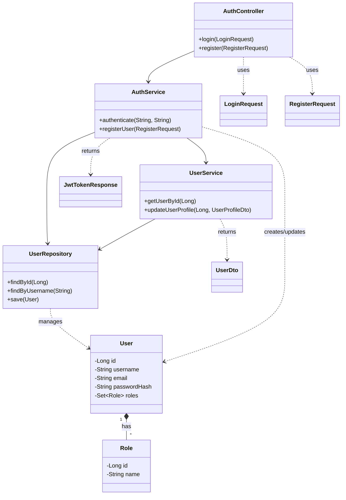

# 통합 AGI 시스템 객체 모델 설계

## 1. 개요

이 문서는 Spring Boot 3.4.5, Java 17 기반의 통합 AGI 시스템을 위한 객체 모델 설계를 설명합니다. 객체 모델은 도메인 주도 설계(Domain-Driven Design) 원칙을 일부 적용하여 시스템의 핵심 개념과 관계를 클래스 및 인터페이스로 표현합니다. 이 설계는 시스템 아키텍처, 데이터베이스 스키마, API 설계와 일관성을 유지합니다.

## 2. 설계 원칙

1.  **응집도 높고 결합도 낮은 설계**: 각 클래스와 모듈은 특정 책임에 집중하고 다른 컴포넌트와의 의존성을 최소화합니다.
2.  **명확한 책임 분리**: Controller, Service, Repository, Domain Entity, DTO 등의 계층별 책임을 명확히 구분합니다.
3.  **인터페이스 기반 설계**: 주요 컴포넌트 간의 상호작용은 인터페이스를 통해 정의하여 유연성과 테스트 용이성을 높입니다.
4.  **불변성 활용**: 가능한 경우 불변 객체(Immutable Objects)를 사용하여 상태 관리의 복잡성을 줄이고 스레드 안전성을 높입니다.
5.  **DTO 사용**: API 계층과 서비스 계층 간 데이터 전달 시 DTO(Data Transfer Object)를 사용하여 도메인 모델 노출을 최소화하고 API 계약을 명확히 합니다.
6.  **JPA 엔티티 설계 가이드라인 준수**: 이전에 정의된 JPA 엔티티 설계 가이드라인(생성자 빌더, 보호된 기본 생성자 등)을 따릅니다.

## 3. 주요 패키지 구조

```
com.agi
├── AgiApplication.java
├── config          // 설정 클래스 (QuerydslConfig, SecurityConfig 등)
├── controller      // API 요청 처리 (RestController)
│   ├── dto         // Controller 계층 DTO (Request/Response)
│   └── impl        // Controller 구현체
├── domain          // 핵심 도메인 모델
│   ├── entity      // JPA 엔티티
│   ├── repository  // 데이터 접근 인터페이스 (Spring Data JPA)
│   └── vo          // 값 객체 (Value Objects)
├── service         // 비즈니스 로직 처리
│   ├── dto         // Service 계층 DTO
│   ├── impl        // Service 구현체
│   └── module      // AGI 핵심 모듈 인터페이스 및 구현
├── exception       // 사용자 정의 예외 클래스
├── util            // 유틸리티 클래스
└── common          // 공통 코드 (상수, 기본 클래스 등)
```

## 4. 핵심 도메인 객체 모델

### 4.1 사용자 도메인 (User Domain)

-   **Entity**: `User`, `Role`, `Permission`, `Session`
-   **Repository**: `UserRepository`, `RoleRepository`, `PermissionRepository`, `SessionRepository`
-   **Service**: `UserService`, `AuthService`
-   **Controller**: `UserController`, `AuthController`
-   **DTO**: `UserDto`, `RoleDto`, `PermissionDto`, `LoginRequest`, `RegisterRequest`, `JwtTokenResponse`

```java
// Entity 예시: User.java
@Entity
@Table(name = "user")
@Getter
@NoArgsConstructor(access = AccessLevel.PROTECTED)
public class User extends BaseTimeEntity {
    @Id @GeneratedValue(strategy = GenerationType.IDENTITY)
    private Long id;

    @Column(nullable = false, unique = true, length = 50)
    private String username;

    @Column(nullable = false, unique = true, length = 100)
    private String email;

    @Column(nullable = false)
    private String passwordHash;

    // ... 기타 필드

    @ManyToMany(fetch = FetchType.EAGER)
    @JoinTable(
        name = "user_role",
        joinColumns = @JoinColumn(name = "user_id"),
        inverseJoinColumns = @JoinColumn(name = "role_id")
    )
    private Set<Role> roles = new HashSet<>();

    @Builder
    public User(String username, String email, String passwordHash, String firstName, String lastName) {
        this.username = username;
        this.email = email;
        this.passwordHash = passwordHash;
        // ... 필드 초기화
    }
}

// DTO 예시: UserDto.java
@Getter
@Builder
public class UserDto {
    private Long id;
    private String username;
    private String email;
    private String firstName;
    private String lastName;
    private LocalDateTime createdAt;
    private Set<String> roles;

    public static UserDto fromEntity(User user) {
        return UserDto.builder()
            .id(user.getId())
            .username(user.getUsername())
            .email(user.getEmail())
            // ... 매핑
            .roles(user.getRoles().stream().map(Role::getName).collect(Collectors.toSet()))
            .build();
    }
}

// Service 예시: UserService.java
@Service
@RequiredArgsConstructor
@Transactional(readOnly = true)
public class UserService {
    private final UserRepository userRepository;
    private final RoleRepository roleRepository;
    private final PasswordEncoder passwordEncoder;

    @Transactional
    public UserDto registerUser(RegisterRequest request) {
        // 중복 검사
        if (userRepository.existsByUsername(request.getUsername())) {
            throw new UserAlreadyExistsException("Username already exists: " + request.getUsername());
        }
        // 비밀번호 암호화
        String encodedPassword = passwordEncoder.encode(request.getPassword());
        // 기본 역할 할당
        Role userRole = roleRepository.findByName("ROLE_USER")
            .orElseThrow(() -> new RoleNotFoundException("Default role ROLE_USER not found"));

        User newUser = User.builder()
            .username(request.getUsername())
            .email(request.getEmail())
            .passwordHash(encodedPassword)
            .build();
        newUser.getRoles().add(userRole);

        User savedUser = userRepository.save(newUser);
        return UserDto.fromEntity(savedUser);
    }
    // ... 기타 메서드
}
```

### 4.2 대화 도메인 (Conversation Domain)

-   **Entity**: `Conversation`, `Message`, `Intent`, `Entity`, `Sentiment`
-   **Repository**: `ConversationRepository`, `MessageRepository`, `IntentRepository`, `EntityRepository`, `SentimentRepository`
-   **Service**: `ConversationService`, `MessageService`
-   **Controller**: `ConversationController` (NLP Controller 내 통합 가능)
-   **DTO**: `ConversationDto`, `MessageDto`, `IntentDto`, `EntityDto`, `SentimentDto`, `ConversationRequest`, `ConversationResponse`

```java
// Entity 예시: Message.java
@Entity
@Table(name = "message")
@Getter
@NoArgsConstructor(access = AccessLevel.PROTECTED)
public class Message {
    @Id
    private String id;

    @ManyToOne(fetch = FetchType.LAZY)
    @JoinColumn(name = "conversation_id", nullable = false)
    private Conversation conversation;

    @Enumerated(EnumType.STRING)
    @Column(nullable = false)
    private MessageRole role;

    @Lob
    @Column(nullable = false)
    private String content;

    @Column(name = "created_at", nullable = false, updatable = false)
    private LocalDateTime createdAt;

    @Lob
    private byte[] embedding;

    @JdbcTypeCode(SqlTypes.JSON)
    private Map<String, Object> metadata;

    @OneToMany(mappedBy = "message", cascade = CascadeType.ALL, orphanRemoval = true)
    private List<Intent> intents = new ArrayList<>();

    @OneToMany(mappedBy = "message", cascade = CascadeType.ALL, orphanRemoval = true)
    private List<EntityExtraction> entities = new ArrayList<>(); // Entity는 예약어일 수 있으므로 이름 변경

    @OneToOne(mappedBy = "message", cascade = CascadeType.ALL, orphanRemoval = true)
    private Sentiment sentiment;

    @Builder
    public Message(Conversation conversation, MessageRole role, String content, Map<String, Object> metadata) {
        this.id = UUID.randomUUID().toString();
        this.conversation = conversation;
        this.role = role;
        this.content = content;
        this.metadata = metadata;
        this.createdAt = LocalDateTime.now();
    }
    // 연관관계 편의 메서드 추가 가능
}

// DTO 예시: MessageDto.java
@Getter
@Builder
public class MessageDto {
    private String id;
    private String conversationId;
    private String role;
    private String content;
    private LocalDateTime createdAt;
    private Map<String, Object> metadata;
    private List<IntentDto> intents;
    private List<EntityDto> entities;
    private SentimentDto sentiment;

    public static MessageDto fromEntity(Message message) {
        return MessageDto.builder()
            .id(message.getId())
            .conversationId(message.getConversation().getId())
            .role(message.getRole().name())
            .content(message.getContent())
            .createdAt(message.getCreatedAt())
            .metadata(message.getMetadata())
            // ... 연관 DTO 매핑
            .build();
    }
}
```

### 4.3 도구 도메인 (Tool Domain)

-   **Entity**: `Tool`, `ToolParameter`, `ToolExecution`
-   **Repository**: `ToolRepository`, `ToolParameterRepository`, `ToolExecutionRepository`
-   **Service**: `ToolService`, `ToolExecutorService`
-   **Controller**: `ToolController`
-   **DTO**: `ToolDto`, `ToolParameterDto`, `ToolExecutionDto`, `ToolExecutionRequest`, `ToolExecutionResponse`
-   **Interface**: `Tool` (실제 도구 구현체 인터페이스)

```java
// Entity 예시: ToolExecution.java
@Entity
@Table(name = "tool_execution")
@Getter
@NoArgsConstructor(access = AccessLevel.PROTECTED)
public class ToolExecution {
    @Id
    private String id;

    @ManyToOne(fetch = FetchType.LAZY)
    @JoinColumn(name = "tool_id", nullable = false)
    private Tool tool;

    @ManyToOne(fetch = FetchType.LAZY)
    @JoinColumn(name = "user_id")
    private User user;

    @ManyToOne(fetch = FetchType.LAZY)
    @JoinColumn(name = "session_id")
    private Session session;

    @JdbcTypeCode(SqlTypes.JSON)
    private Map<String, Object> parameters;

    @JdbcTypeCode(SqlTypes.JSON)
    private Map<String, Object> result;

    @Enumerated(EnumType.STRING)
    @Column(nullable = false)
    private ExecutionStatus status;

    @Lob
    private String errorMessage;

    @Column(nullable = false, updatable = false)
    private LocalDateTime createdAt;
    private LocalDateTime startedAt;
    private LocalDateTime completedAt;

    @Builder
    public ToolExecution(Tool tool, User user, Session session, Map<String, Object> parameters) {
        this.id = UUID.randomUUID().toString();
        this.tool = tool;
        this.user = user;
        this.session = session;
        this.parameters = parameters;
        this.status = ExecutionStatus.PENDING;
        this.createdAt = LocalDateTime.now();
    }
    // 상태 변경 메서드 추가
}

// Interface 예시: Tool.java (실제 도구 구현체)
public interface ExecutableTool {
    String getName();
    String getDescription();
    List<ToolParameterDefinition> getParameterDefinitions();
    ToolResult execute(Map<String, Object> parameters, Context context);
}
```

### 4.4 계획 도메인 (Plan Domain)

-   **Entity**: `Plan`, `PlanStep`, `PlanExecution`, `StepExecution`
-   **Repository**: `PlanRepository`, `PlanStepRepository`, `PlanExecutionRepository`, `StepExecutionRepository`
-   **Service**: `PlanService`, `PlanExecutionService`
-   **Controller**: `PlanController`
-   **DTO**: `PlanDto`, `PlanStepDto`, `PlanExecutionDto`, `StepExecutionDto`, `PlanRequest`, `PlanResponse`

### 4.5 지식 및 기억 도메인 (Knowledge & Memory Domain)

-   **Entity**: `Knowledge`, `Memory`, `Context`, `KnowledgeRelation`
-   **Repository**: `KnowledgeRepository`, `MemoryRepository`, `ContextRepository`, `KnowledgeRelationRepository`
-   **Service**: `KnowledgeService`, `MemoryService`, `ContextService`, `ReasoningService`
-   **Controller**: `KnowledgeController`, `MemoryController`
-   **DTO**: `KnowledgeDto`, `MemoryDto`, `ContextDto`, `KnowledgeSearchRequest`, `KnowledgeSearchResponse`

### 4.6 멀티모달 도메인 (Multimodal Domain)

-   **Entity**: `ImageMetadata`, `AudioMetadata`, `VideoMetadata`, `MediaObject`
-   **Repository**: `ImageMetadataRepository`, `AudioMetadataRepository`, `VideoMetadataRepository`, `MediaObjectRepository`
-   **Service**: `MediaService`, `ImageProcessingService`, `AudioProcessingService`, `VideoProcessingService`
-   **Controller**: `MediaController`
-   **DTO**: `ImageMetadataDto`, `AudioMetadataDto`, `VideoMetadataDto`, `MediaProcessingRequest`, `MediaProcessingResponse`

### 4.7 학습 및 피드백 도메인 (Learning & Feedback Domain)

-   **Entity**: `Feedback`, `LearningData`, `ModelVersion`, `TrainingJob`
-   **Repository**: `FeedbackRepository`, `LearningDataRepository`, `ModelVersionRepository`, `TrainingJobRepository`
-   **Service**: `FeedbackService`, `LearningService`, `ModelManagementService`
-   **Controller**: `LearningController`
-   **DTO**: `FeedbackDto`, `ModelVersionDto`, `FeedbackRequest`

## 5. 핵심 서비스 및 모듈 인터페이스

시스템 아키텍처에서 정의된 주요 모듈들은 인터페이스로 정의되고 구현됩니다.

```java
// Module 인터페이스 (아키텍처 설계 참조)
public interface Module {
    String getName();
    Response process(Request request, Context context);
    // 스트리밍 처리, 초기화 등 추가 메서드 가능
}

// NLP Engine 인터페이스 예시
public interface NLPEngine extends Module {
    ConversationResponse handleConversation(ConversationRequest request, Context context);
    AnalysisResponse analyzeText(AnalysisRequest request);
    GenerationResponse generateText(GenerationRequest request, Context context);
    // ... 기타 NLP 기능 인터페이스
}

// Tool Framework 인터페이스 예시
public interface ToolFramework extends Module {
    List<ToolDto> listAvailableTools();
    ToolExecutionResponse executeTool(ToolExecutionRequest request, Context context);
    void registerTool(ExecutableTool tool);
}

// Planning Module 인터페이스 예시
public interface PlanningModule extends Module {
    PlanResponse createPlan(PlanRequest request, Context context);
    PlanExecutionResponse executePlan(String planId, Context context);
    PlanStatusResponse monitorPlan(String planId);
}

// 기타 모듈 인터페이스 (KnowledgeMemorySystem, MultimodalProcessingModule 등)
```

## 6. 클래스 다이어그램 (UML - 주요 관계 예시)

(Markdown으로 UML 표현은 제한적이므로, 주요 관계를 텍스트로 설명)

-   **Controller -> Service**: Controller는 HTTP 요청을 받아 DTO로 변환 후 해당 Service 메서드를 호출합니다. Service의 응답 DTO를 받아 HTTP 응답으로 변환합니다.
-   **Service -> Repository**: Service는 비즈니스 로직을 수행하며, 데이터 영속성이 필요할 때 Repository 인터페이스를 통해 데이터베이스와 상호작용합니다.
-   **Service -> Service/Module**: Service는 다른 Service나 핵심 Module 인터페이스를 호출하여 필요한 기능을 위임할 수 있습니다. (예: `ConversationService`가 `NLPEngine` 모듈 호출)
-   **Entity <-> Repository**: Repository는 특정 Entity의 CRUD 작업을 담당합니다.
-   **Entity 관계**: `@OneToMany`, `@ManyToOne`, `@ManyToMany` 등을 사용하여 Entity 간의 관계를 정의합니다. (예: `Conversation` <-> `Message`)
-   **DTO <-> Entity**: Service 계층 또는 Mapper 유틸리티에서 DTO와 Entity 간의 변환을 수행합니다.



## 7. 결론

이 객체 모델 설계는 통합 AGI 시스템의 핵심 도메인과 상호작용을 정의합니다. 명확한 책임 분리, 인터페이스 기반 설계, DTO 사용 등을 통해 유연하고 확장 가능하며 유지보수하기 쉬운 코드 구조를 목표로 합니다. 이 설계는 시스템 아키텍처, 데이터베이스 스키마, API 설계와 연계되어 시스템 전체의 일관성을 보장합니다. 실제 구현 시에는 세부적인 예외 처리, 로깅, 트랜잭션 관리 등이 추가적으로 고려되어야 합니다.
